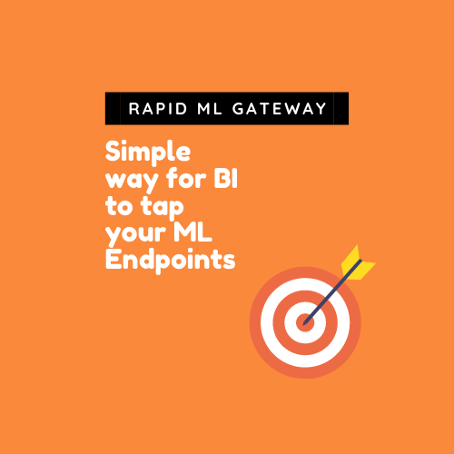

# Introduction

**Rapid Machine Learning Gateway**
 Simple way to BI tools to tap your ML Endpoints from your BI tools.

Rapid ML Gateway(RML) is an open source Python implementation of QlikTM Server Side Extension that simplifies bi-directional data exchange between Qlik Application and Popular ML endpoint data. _The Origins of this project started as Qlik Rapid API Gateway but due to complications it was fully opensourced_

**As of May 2021 It was decided that this project will become a OSS Project for the larger community and Qlik, Inc will no have involvement in this project.**
Following Decisions were made 

- It was renamed **Rapid ML Gateway** from **Qlik Rapid API Gateway**
- RML(Rapid ML Gateway) is not Qlik Supported Project/Product
- **Qlik Inc. or Qlik Support** has no affiliation with this project other than initial code was written by John Park who is currently employed as Principal Solution Architect at Qlik Partner Engineering.
- Customers may access Qlik Partner Engineering via their Qlik Account Rep or this Repo if help is needed.
- This project is run as Open Source project with MIT License.
- The users of this code base should do so at their own discretion
- If you are thinking about using this product plese contact Qlik Account Rep if further assistance is needed.
- Contributions such as Issues, Pull Request and additional codes are welcomed.

The intial use case was to allow Qlik to use AI/ML functions and interact with other executions engines. The system utilizes GRPC messaging from Qlik and currently in the inital release support REST, Websocket APIs.

Integration Use Cases are Following

- Integration with Open API Calls - Bi Directional Data Flow
- Interacting with Qlik Data on Third Party APIs
- Training ML Models with Qlik Data(Delayed until AutoML functionality is matured)
- Scoring Qlik Data against ML Models(Delayed until AutoML functionality is matured)
- Integration to AWS Sagemaker
- Integration to R
- Integration to Python
- Integration to Databricks
- Integration with GCP Tensor Flow
- Integration with Azure Cognitive Services

The system is built around quickly **using qrag.ini and functions.json** to send request and **add results back into QIX engine**. The goal of Rapid ML Gateway is to  It's goal is to help Qlik users integrate into API/Microservices Architecture.

**Note: RML is in the Beta TESTING PHASE.** Core functionality is complete, please let This g Team know if you run into any data, compatibility or install issues! Thank you for [reporting any BUGS in the issue tracking system here](https://github.com/Qlik-PE/Qlik-Rapid-API-Gateway/issues), and We welcome your feedback and questions on usage/features.

**Things that may happen if there is Developer/Customer demand.**

- Office Hours
- Installation Videos
- Use Case Videos
- UI for Configuration rather than Configuration of Ini files

For Initial Release our target is support AWS Sagemaker Platform.
Please take a look at Readme inside Sagemaker folder

# Licenses

RML is published under MIT License Model which allows users to easily modify and share with your fellow Developers.  For anyone interested in license please take a look at MIT License [wiki](https://en.wikipedia.org/wiki/MIT_License)

# Code of Conduct.

Qlik Partner Engineering will adopt. [Contributor Covenant Code of Conduct](https://github.com/Qlik-PE/Qlik-Rapid-API-Gateway/blob/master/CODE_OF_CONDUCT.md).  Please act accordingly.

# Example

[Breast Cancer Predictions Using Sage Maker](http://pe.qlik.com/sense/app/7693d173-d1aa-4c1a-bce0-d0077c8f378f/overview)  
_This Qlik Application uses Data from UCI ML Repo and uses winning Model from Kaggle to Predict Breast Cancer Diagnosis based on SagmeMaker Endpoint.  Components used in integrations are AWS API Gateway, Lambda, AWS Sagemaker and Qlik_

# Features

## version 0.1.0 - Released August, 2020

- Integration with API Gateway
- Integration with AWS Lambda
- Integration with AWS Sagemaker Endpoint
- Support for Websocket
- Support for REST Endpoints  

## version 0.1.1 Released November, 2020

- Docker Support
- Precog Support
- Azure Cognitive Services Support

## versions 0.1.2 

- Security Mechanism
- Statisics
- Real Time Monitoring

  
***(More Fatures and versions will be released)***  

# Limitation

- Return value of RML Functions must be measures or dimensions wrapped in Qlik Function.
- Parallel Execution is not supported
- Expected Input and Output Data Type is String
- Input Value should be joined as comma seperated string in Qlik Script and sent into function
- Currenlty only supports REST and WebSockets

# Installation

QRAG currently supports Python 3.8+ and Qlik Server 13.72.5+.
Official Docker and Exe Support is due soon.
Each API Connector will need small different setting changes

# Modules

- Sagemaker
- Precog
- Databricks
- Azure Cognitive Services
- Prophet(Release Date TBD)
- Dataiku(Release Date TBD)
- MLFlow(Release Date TBD)
## Using Docker

Please pull from Docker hub from Partner Engineering Organization  
[Qlik Partner Engineering Docker Hub](https://hub.docker.com/repository/docker/qlikpe/qrag)  
[Qlik PE QRAG Realse Notes](https://github.com/Qlik-PE/Qlik-Rapid-API-Gateway/blob/master/docker/README.md)  
#For Sample Test Please run (Please note Sagemaker Service is turned on and it is recommended you only turn on signle module for each Container for Production Use Case)
`docker run -d -p 50057:50057  --name qrag4 qlikpe/qrag:latest`

# Basic Usage

1. Install QRAG on Qlik Server/ Remote Server
2. Define functions in functions.json
3. Define QRAG setting in QRAG.ini
4. Restart Qlik Engine

**_For Specific Installation and Details Please see specific installations below_**

[AWS Sagemaker](https://github.com/Qlik-PE/Qlik-Rapid-API-Gateway/blob/master/sagemaker/README.md)

# Contribute

I ([John Park](john.park@qlik.com )) built it to be the most useful tool possible and take frustration out of writing SSEs. I also want to have all partner tools compatible with RML. If you have a toolset that you want to build compatibility with please let us know we can setup a folder and you can commit your code.

### 1. Spread the word !

A STAR here on GitHub(https://github.com/Qlik-PE/Qlik-Rapid-API-Gateway), and a mention on Twitter or Instagram @jpark328 and blog post are the easiest contribution and can potentially help grow this project tremendously!

Medium articles, YouTube video tutorials and other content take more time but will help all the more!

### 2. Report bugs & issues

I expect there to be many quirks once the project is used by more and more people with a variety of new (& "unclean") data. If you found a bug, please [open a new issue here](https://github.com/Qlik-PE/Qlik-Rapid-API-Gateway/issues).  Please change logging level to "DEBUG" and upload log files/snippets.

### 3. Suggest and discuss usage/features

To make RML as useful as possible we need to hear what you would like it to do, or what it could do better! [Head over to Github Wiki to Place Feature/Request](https://github.com/Qlik-PE/Qlik-Rapid-API-Gateway/issues).

### 4. Contribute to the development

We definitely welcome the help I can get on this project, simply get in touch on the issue tracker.

### 5. Bug Fixes and Pull Requests

There will be a monthly Pull Requests Merge done. Please stay tuned.

### 6. About Author and Team Behind the Project

Please email people on this list if there are questions and concerns about this project.

- Main Author: [John Park](john.park@qlik.com) Qlik, Principal Solution Architect
- Support: [Hugo Sheng](hugo.shengk@qlik.com) Qlik, Partner Engineering

