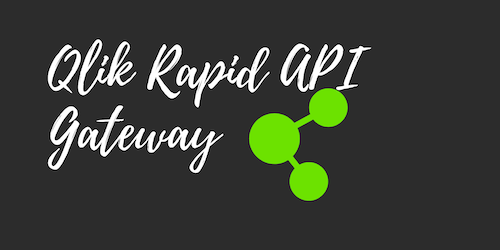

# Integrating Qlik with Sagemaker

Qlik Rapid API Gateway usese AWS Sagemaker Endpoint and AWS Lambda/AWS API Gateway for Integration.

## Integration Use Cases are Following

- Scoring Data Prepped by Qlik Sense with Sagemaker
- Training Sagemaker Model with Data Residing Inside Qlik Sense
- AUC Curve / MAE Creation

## Installation and Setup

## Testing

## Architectural Diagram

## References